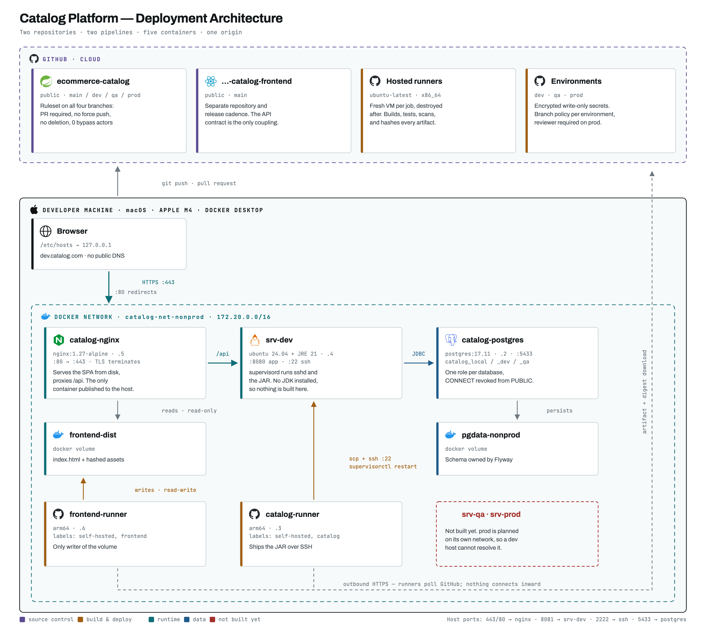

# E-commerce Catalog Service

A Spring Boot product catalog with a full DevOps delivery chain: two repositories, two
pipelines, self-hosted runners, and a five-container estate behind a single TLS origin —
all running on one laptop, built to behave the way a real environment does.

The administration UI lives in a separate repository:
**[ecommerce-catalog-frontend](https://github.com/shashikirankulkarni/ecommerce-catalog-frontend)**



---

## What this is

A working service, and a record of building the pipeline around it. The method was
deliberate: **ship it insecure, scan it, read the reports, then fix what the scanners
actually found.** Hardcoded credentials came first on purpose, so remediation had
something real to remediate.

[`SECURITY-FINDINGS.md`](SECURITY-FINDINGS.md) is the result — 13 CVEs and 13 planted
credentials, before and after, measured rather than asserted. The uncomfortable finding:
**two dedicated secret scanners found 3 of the 13.**

[`DEVOPS-PLAN.md`](DEVOPS-PLAN.md) is the plan the work followed.

## Stack

| | |
|---|---|
| Runtime | Java 21, Spring Boot 4.1.1, Tomcat 11 |
| Data | PostgreSQL 17, Flyway, JPA/Hibernate, HikariCP |
| API docs | springdoc-openapi 3.1 |
| Build | Maven (wrapper), Testcontainers |
| Edge | nginx 1.27, TLS terminated at the proxy |
| CI/CD | GitHub Actions — hosted runners for CI, self-hosted for deployment |
| Infra | Docker Compose — Postgres, app server, proxy, two runners |

## Quick start

```bash
git clone https://github.com/shashikirankulkarni/ecommerce-catalog.git
cd ecommerce-catalog

cp .env.example .env                            # fill in any values you like
cp docker/postgres/.env.example docker/postgres/.env

docker compose --profile db up -d --wait        # PostgreSQL on :5433
./mvnw spring-boot:run                          # the app on :8080
scripts/seed.sh http://localhost:8080           # 21 sample products
```

Then:

| | |
|---|---|
| API | <http://localhost:8080/api/v1/products> |
| Swagger UI | <http://localhost:8080/swagger-ui.html> |
| Health | <http://localhost:8080/actuator/health> |

**The application will not start without configuration**, and that is deliberate. Every
secret is an environment variable with **no default** — a fallback like
`${DB_PASSWORD:changeme}` lets the app boot on the wrong credential and fail somewhere far
from the cause. A missing value fails at startup, naming the variable.

## API

Base path `/api/v1/products`.

| Method | Path | |
|---|---|---|
| `GET` | `/` | list; `?category=` and `?includeInactive=` |
| `GET` | `/{id}` | fetch by id |
| `GET` | `/sku/{sku}` | fetch by SKU |
| `POST` | `/` | create → **201** with `Location` |
| `PUT` | `/{id}` | replace |
| `DELETE` | `/{id}` | **soft** delete — sets `active = false` |
| `PUT` | `/{id}/activate` | reactivate |

Errors are [RFC 7807](https://datatracker.ietf.org/doc/html/rfc7807) problem details, so a
validation failure returns a per-field breakdown rather than a flattened message:

```json
{
  "type": "https://catalog.shashi.com/errors/validation-failed",
  "title": "Validation failed",
  "status": 400,
  "detail": "One or more fields are invalid",
  "errors": { "sku": "sku is required", "price": "price must not be negative" }
}
```

`DELETE` deactivates rather than removing the row. An order line referring to a deleted
product would break referential integrity; deactivated products simply stop appearing in
customer-facing queries.

## Running the full estate

```bash
docker compose --profile db  up -d     # Postgres only          ~200 MB
docker compose --profile dev up -d     # + proxy, server, runners
```

| Container | Purpose |
|---|---|
| `catalog-postgres-nonprod` | `catalog_local`, `catalog_dev`, `catalog_qa` — one role each |
| `srv-dev` | application server: Ubuntu + JRE 21 + sshd + supervisord. **No JDK** |
| `catalog-nginx` | TLS termination, hostname routing, static files, reverse proxy |
| `catalog-runner` | deploys the backend |
| `frontend-runner` | deploys the UI |

The self-hosted runners need registration tokens:

```bash
export RUNNER_TOKEN=$(gh api -X POST \
  repos/shashikirankulkarni/ecommerce-catalog/actions/runners/registration-token --jq .token)
export RUNNER_TOKEN_FRONTEND=$(gh api -X POST \
  repos/shashikirankulkarni/ecommerce-catalog-frontend/actions/runners/registration-token --jq .token)
```

A registration token is not a stored credential. It is minted on demand, expires in an
hour, and is exchanged once for the runner's own long-lived credential.

For `https://dev.catalog.com`, add a hosts entry and generate the certificate:

```bash
echo "127.0.0.1  dev.catalog.com qa.catalog.com catalog.com" | sudo tee -a /etc/hosts
docker/nginx/generate-certs.sh          # prints the keychain trust command
```

## Environments

| | Database | Reached at | Deploys on |
|---|---|---|---|
| `local` | `catalog_local` | `localhost:8080` | run from the IDE |
| `dev` | `catalog_dev` | `https://dev.catalog.com` | merge to `dev` |
| `qa` | `catalog_qa` | *not built* | merge to `qa` |
| `prod` | *not built* | *not built* | merge to `prod`, with approval |

Every database has its own role, and `CONNECT` is **revoked from `PUBLIC`** — so a dev
credential does not merely fail authentication against the qa database, it cannot open a
connection at all:

```
FATAL: permission denied for database "catalog_qa"
DETAIL: User does not have CONNECT privilege.
```

## Pipelines

```
feature/*  ──PR──▶  main  ──PR──▶  dev  ──PR──▶  qa  ──PR──▶  prod
              │                      │            │             │
           CI gate               deploy       deploy    deploy + approval
```

**`ci.yml`** — on pull requests into `main`. Always GitHub-hosted: that trigger fires for
forks, so it can be asked to run a stranger's code, which must never reach a self-hosted
runner.

**`deploy.yml`** — on push to `dev`/`qa`/`prod`. Two jobs:

- **build** on `ubuntu-latest`: compile, run the tests (Testcontainers needs Docker, which
  the self-hosted runner deliberately does not have), record the artifact's SHA-256
- **deploy** on the self-hosted runner: download that artifact, **re-verify the digest**,
  render `.env` under `umask 077`, `scp` it and the JAR, restart through supervisord, poll
  `/actuator/health`, roll back on failure, then `shred` the env file

The digest is checked twice — after download, and read back off the server. That turns
*"is the server running what we tested?"* into a checked fact.

One line covers three environments:

```yaml
environment: ${{ github.ref_name }}
```

It resolves to `dev`, `qa` or `prod` from the branch name, selecting that environment's
secrets and arming its protection rules — including the required reviewer on `prod`.

## Where the secrets are, and are not

No credential exists in this repository, in the build artifact, or in any image. Extracting
the properties file from the deployed JAR returns placeholders:

```
$ unzip -p /opt/catalog/catalog.jar BOOT-INF/classes/application.properties
spring.datasource.password=${DB_PASSWORD}
app.payment.stripe-key=${STRIPE_KEY}
```

| Where | Form | Lifetime |
|---|---|---|
| GitHub environment secrets | encrypted, write-only | until rotated |
| Runner workspace | file, mode 600 | ~11 seconds, then shredded |
| `srv-dev:/opt/catalog/.env` | file, mode 600, owned by `deploy` | until the next deploy |
| JVM process environment | plaintext in memory | while running |
| The JAR, the repo, the images | **never** | — |

That `.env` on the server is **generated output**, rewritten by every deploy. Never edit it
by hand — to rotate a credential, change the GitHub secret and redeploy.

**The honest limit:** environment variables are not encrypted at runtime. Anyone who can
become the `deploy` user reads them from `/proc/<pid>/environ`. This protects credentials
in the repository and in transit, not from someone already on the host.

## Layout

```
src/main/java/com/shashi/catalog/
  domain/      Product, ProductRepository
  service/     ProductService and its exceptions
  web/         ProductController, GlobalExceptionHandler, DTOs
  config/      PaymentProperties, JwtProperties, AwsProperties, ConfigGuard
  payment/     PaymentService (stub)
src/main/resources/
  application.properties            placeholders only, no values
  application-{local,dev,qa,prod}.properties
  db/migration/V1__create_product_table.sql
docker/
  postgres/    initdb script (shell, so passwords come from the environment)
  server/      srv-dev image — JRE, sshd, supervisord
  runner/      GitHub Actions runner image
  nginx/       proxy config, TLS certificate generator
scripts/seed.sh
docs/          architecture diagram and its generator
```

## Testing

```bash
./mvnw verify        # unit + a Spring context test on a real Postgres via Testcontainers
```

Testcontainers is pinned to `postgres:17` — the same version production runs. With `latest`
the tests would silently drift onto whatever Postgres is newest that day, giving a green
build today and a mystery failure tomorrow with no code change in between.

## Not built yet

- `srv-qa` and `srv-prod`
- `catalog-net-prod`, the isolated production network
- the production approval gate, exercised end to end
- required status checks on the ruleset — a merge can currently outrun its own build
- an artifact registry for true build-once-promote-many
- ephemeral runners, which is why the deploy shreds its own workspace files

## A note on the credentials in this repository

Every credential value that appears in the history or documentation is **fabricated**. They
were planted deliberately as material for the scanning exercise and remediated in the
commits that follow. No live system, account or key is exposed by anything here.
